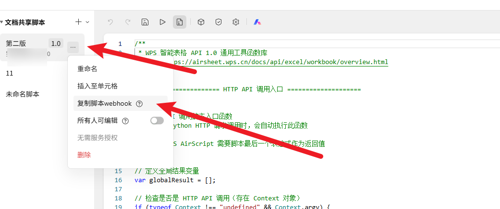
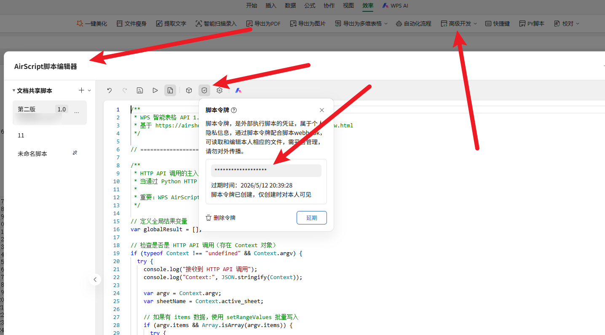

# WPS 智能表格 AirScript API 项目

一个简洁易用的 WPS 智能表格 API 客户端，支持 JavaScript 和 Python 两种实现方式。

## 📋 项目简介

本项目提供了操作 WPS 智能表格的常用 API 接口，包括：

- 单元格读写操作
- 格式化设置（字体、颜色、对齐、边框等）
- 行列操作（插入、删除、调整大小）
- 查找和替换
- 排序和复制粘贴
- 工作表管理
- 批量数据处理

## 🚀 快速开始

### Python 客户端

#### 1. 安装依赖

```bash
pip install requests
```

#### 2. 初始化客户端

```python
from python.wps_airscript_client import WPSAirScriptClient

client = WPSAirScriptClient(
    file_id="your_file_id",  # 必填：文件 ID
    token="your_token",  # 必填：脚本token
    script_id="your_script_id",  # 必填：脚本ID
)
```

#### 3. 基本使用

```python
# 读取单元格
value = client.get_cell_value("A1")
print(value)

# 写入单元格
client.set_cell_value("A1", "Hello WPS")

# 批量写入数据
data = [
    ['姓名', '年龄', '城市'],
    ['张三', 25, '北京'],
    ['李四', 30, '上海']
]
client.batch_write(data, start_cell="A1")
```

### JavaScript 实现

JavaScript 版本位于 `wps-airsheet-api.js`，可直接在 WPS AirScript 环境中使用。

## 📚 API 快速参考

### 单元格操作

| 方法                                                  | 说明           | 示例                                            |
| ----------------------------------------------------- | -------------- | ----------------------------------------------- |
| `get_cell_value(address, sheet_name=None)`            | 获取单元格值   | `client.get_cell_value("A1")`                   |
| `set_cell_value(address, value, sheet_name=None)`     | 设置单元格值   | `client.set_cell_value("A1", "Hello")`          |
| `get_range_values(address, sheet_name=None)`          | 获取区域值     | `client.get_range_values("A1:C3")`              |
| `set_range_values(address, values, sheet_name=None)`  | 设置区域值     | `client.set_range_values("A1:C3", data)`        |
| `batch_write(data, start_cell="A1", sheet_name=None)` | 批量写入       | `client.batch_write(data, "A1")`                |
| `clear_range(address, sheet_name=None)`               | 清除内容和格式 | `client.clear_range("A1:C3")`                   |
| `get_cell_formula(address, sheet_name=None)`          | 获取公式       | `client.get_cell_formula("A1")`                 |
| `set_cell_formula(address, formula, sheet_name=None)` | 设置公式       | `client.set_cell_formula("A1", "=SUM(B1:B10)")` |

### 格式化操作

| 方法                                                      | 说明         | 示例                                                |
| --------------------------------------------------------- | ------------ | --------------------------------------------------- |
| `set_font(address, font_options, sheet_name=None)`        | 设置字体     | `client.set_font("A1", {"bold": True, "size": 14})` |
| `set_background_color(address, color, sheet_name=None)`   | 设置背景色   | `client.set_background_color("A1", 0xFFFF00)`       |
| `set_alignment(address, align_options, sheet_name=None)`  | 设置对齐     | `client.set_alignment("A1", {"horizontal": -4108})` |
| `set_border(address, border_options, sheet_name=None)`    | 设置边框     | `client.set_border("A1:C3", {"style": "thin"})`     |
| `merge_cells(address, sheet_name=None)`                   | 合并单元格   | `client.merge_cells("A1:C1")`                       |
| `set_number_format(address, format_str, sheet_name=None)` | 设置数字格式 | `client.set_number_format("A1", "0.00")`            |
| `auto_fit_columns(address, sheet_name=None)`              | 自动调整列宽 | `client.auto_fit_columns("A:C")`                    |

### 行列操作

| 方法                                                     | 说明     | 示例                             |
| -------------------------------------------------------- | -------- | -------------------------------- |
| `insert_rows(row_index, count=1, sheet_name=None)`       | 插入行   | `client.insert_rows(3, 2)`       |
| `delete_rows(row_index, count=1, sheet_name=None)`       | 删除行   | `client.delete_rows(3, 2)`       |
| `set_row_height(row_index, height, sheet_name=None)`     | 设置行高 | `client.set_row_height(1, 30)`   |
| `insert_columns(column_index, count=1, sheet_name=None)` | 插入列   | `client.insert_columns(2, 1)`    |
| `delete_columns(column_index, count=1, sheet_name=None)` | 删除列   | `client.delete_columns(2, 1)`    |
| `set_column_width(column_index, width, sheet_name=None)` | 设置列宽 | `client.set_column_width(1, 20)` |

### 查找和替换

| 方法                                                                         | 说明         | 示例                                               |
| ---------------------------------------------------------------------------- | ------------ | -------------------------------------------------- |
| `find_cell(search_text, search_range, sheet_name=None)`                      | 查找单元格   | `client.find_cell("Apple", "A1:Z100")`             |
| `find_all_cells(search_text, search_range, sheet_name=None)`                 | 查找所有匹配 | `client.find_all_cells("Apple", "A1:Z100")`        |
| `replace_in_range(search_text, replace_text, search_range, sheet_name=None)` | 替换内容     | `client.replace_in_range("old", "new", "A1:Z100")` |

### 工作表操作

| 方法                                   | 说明               | 示例                                |
| -------------------------------------- | ------------------ | ----------------------------------- |
| `get_worksheet_count()`                | 获取工作表数量     | `client.get_worksheet_count()`      |
| `get_workbook_sheets()`                | 获取所有工作表名称 | `client.get_workbook_sheets()`      |
| `worksheet_exists(sheet_name)`         | 检查工作表是否存在 | `client.worksheet_exists("Sheet1")` |
| `add_worksheet(sheet_name=None)`       | 添加工作表         | `client.add_worksheet("NewSheet")`  |
| `delete_worksheet(sheet_identifier)`   | 删除工作表         | `client.delete_worksheet("Sheet2")` |
| `get_used_range_data(sheet_name=None)` | 获取已使用区域数据 | `client.get_used_range_data()`      |

## 🎯 常用参数说明

### 字体选项 (font_options)

```python
{
    "name": "微软雅黑",    # 字体名称
    "size": 14,           # 字体大小
    "bold": True,         # 粗体
    "italic": False,      # 斜体
    "color": 0xFF0000     # 字体颜色
}
```

### 对齐选项 (align_options)

```python
{
    "horizontal": -4108,  # 水平对齐（居中）
    "vertical": -4108     # 垂直对齐（居中）
}
```

**水平对齐常量**：

- `-4152` (xlHAlignRight) - 靠右
- `-4131` (xlHAlignLeft) - 靠左
- `-4130` (xlHAlignJustify) - 两端对齐
- `-4117` (xlHAlignDistributed) - 分散对齐
- `-4108` (xlHAlignCenter) - 居中
- `1` (xlHAlignGeneral) - 按数据类型对齐
- `5` (xlHAlignFill) - 填充
- `7` (xlHAlignCenterAcrossSelection) - 跨列居中

**垂直对齐常量**：

- `-4160` (xlVAlignTop) - 向上
- `-4130` (xlVAlignJustify) - 调整使全行排满
- `-4117` (xlVAlignDistributed) - 一起
- `-4108` (xlVAlignCenter) - 居中
- `-4107` (xlVAlignBottom) - 向下

### 排序选项 (sort_options)

```python
{
    "key": 2,              # 排序列索引（从 1 开始）
    "order": "asc",        # asc 升序, desc 降序
    "hasHeaders": True     # 是否包含标题行
}
```

### 数字格式字符串

- `"0.00"` - 保留两位小数
- `"#,##0"` - 千分位分隔符
- `"0%"` - 百分比
- `"yyyy-mm-dd"` - 日期格式
- `"h:mm:ss"` - 时间格式

### 颜色转换

```python
# RGB 转 Excel 颜色
red = client.rgb_to_excel_color(255, 0, 0)
green = client.rgb_to_excel_color(0, 255, 0)
blue = client.rgb_to_excel_color(0, 0, 255)
yellow = client.rgb_to_excel_color(255, 255, 0)
```

## 💡 完整示例

### 示例 1: 创建格式化的数据表

```python
from wps_airscript_client import WPSAirScriptClient

# 初始化客户端
client = WPSAirScriptClient(
    script_id="your_script_id",
    token="your_token",
    script_version="your_version"
)

# 准备数据
headers = ['姓名', '年龄', '部门', '工资']
data = [
    ['张三', 25, '技术部', 8000],
    ['李四', 30, '市场部', 9000],
    ['王五', 28, '人事部', 7500]
]

# 写入标题行
client.set_range_values("A1:D1", [headers])

# 设置标题行格式
font_options = {"bold": True, "size": 12}
client.set_font("A1:D1", font_options)

yellow = client.rgb_to_excel_color(255, 255, 0)
client.set_background_color("A1:D1", yellow)

# 居中对齐
align_options = {"horizontal": -4108, "vertical": -4108}
client.set_alignment("A1:D1", align_options)

# 写入数据
client.set_range_values("A2:D4", data)

# 设置工资列格式为货币
client.set_number_format("D2:D4", "#,##0")

# 自动调整列宽
client.auto_fit_columns("A:D")

print("数据表创建完成！")
```

### 示例 2: 数据查找和统计

```python
# 查找所有"技术部"员工
cells = client.find_all_cells("技术部", "C1:C100")
print(f"找到 {len(cells)} 个技术部员工")

# 读取所有数据
all_data = client.get_used_range_data()

# 统计平均工资
salaries = [row[3] for row in all_data[1:]]  # 跳过标题行
avg_salary = sum(salaries) / len(salaries)
print(f"平均工资: {avg_salary}")

# 写入统计结果
client.set_cell_value("F1", "平均工资")
client.set_cell_value("F2", avg_salary)
client.set_number_format("F2", "#,##0.00")
```

### 示例 3: 数据排序

```python
# 按工资降序排序
sort_options = {
    "key": 4,              # 第 4 列（工资）
    "order": "desc",       # 降序
    "hasHeaders": True     # 包含标题行
}
client.sort_range("A1:D4", sort_options)

# 为最高工资行设置高亮
green = client.rgb_to_excel_color(0, 255, 0)
client.set_background_color("A2:D2", green)

print("数据排序完成！")
```

### 示例 4: 批量数据处理

```python
# 读取大量数据
data = client.get_range_values("A1:Z1000")

# 处理数据（例如：将所有数字乘以 2）
processed_data = []
for row in data:
    new_row = []
    for cell in row:
        if isinstance(cell, (int, float)):
            new_row.append(cell * 2)
        else:
            new_row.append(cell)
    processed_data.append(new_row)

# 写回数据
client.set_range_values("A1:Z1000", processed_data)

print("批量处理完成！")
```

## 📁 项目结构

```
# 🧩 WPS Client SDK

一个用于调用 WPS AirScript API 的客户端工具包，支持 **Python** 与 **JavaScript** 两种实现。
可用于自动化表格操作、数据同步、格式调整等。

---

## 📦 项目结构

详见项目目录结构：

```bash
📦 wps_client
├── assets/                    # 图片与资源文件
├── javascript/                # JavaScript 版 API
├── python/                    # Python 客户端封装
├── tests/                     # 单元测试
└── README.md                  # 项目说明

```

## ⚙️ 参数获取方法

### 1. script_id

从 WPS 智能表格 webhook链接 中获取，格式如：

```
https://www.kdocs.cn/api/v3/ide/file/****/script/为你的脚本ID/sync_task
```

其中 `xxxxx` 就是 script_id

### 2. token

在 WPS 表格中生成 AirScript Token，注：需要进行实名认证

### 3. file_id

可以从表格URL中获取，格式如：`https://www.kdocs.cn/api/v3/ide/file/文件id/script/****/sync_task`
## ⚠️ 注意事项

1. ✅ 所有索引从 1 开始（不是 0）
2. ✅ 使用批量方法（如 `batch_write`）提高性能
3. ✅ 颜色使用 `rgb_to_excel_color()` 转换
4. ✅ 不指定 `sheet_name` 则操作当前活动工作表
5. ✅ 对齐方式使用 Excel 常量值（如 -4108 表示居中）
6. ⚠️ 大量数据操作建议分批处理
7. ⚠️ 注意单元格地址格式（大写字母）

## 🔧 错误处理

```python
try:
    client.set_cell_value("A1", "Test")
except Exception as e:
    print(f"操作失败: {e}")
```

## 🤝 贡献

欢迎提交 Issue 和 Pull Request！


## 📞 联系方式

如有问题或建议，请通过以下方式联系：

- 提交 Issue
- 发送邮件

---
## 常见问题

### Q: 如何获取 script_id 和 token？

A: 从 WPS 智能表格Webhook和令牌获取。



### Q: 为什么操作没有生效？

A: 检查工作表名称是否正确，单元格地址格式是否正确。

### Q: 如何提高批量操作性能？

A: 使用 `set_range_values` 或 `batch_write` 一次性写入多个单元格，而不是循环调用 `set_cell_value`。

### Q: 支持哪些数据类型？

A: 支持字符串、数字、布尔值、日期等 Excel 支持的基本类型。

---

## 更多资源

- [Airscript开发者文档](https://airsheet.wps.cn/docs/api/excel/workbook/overview.html)
- [项目 GitHub](https://github.com/1030695584/wps-airsheet-python.git)
- [问题反馈](https://github.com/1030695584/wps-airsheet-python/issues)
- [联系作者](mailto:1030695584@qq.com)

---

**祝你使用愉快！** 🎉
